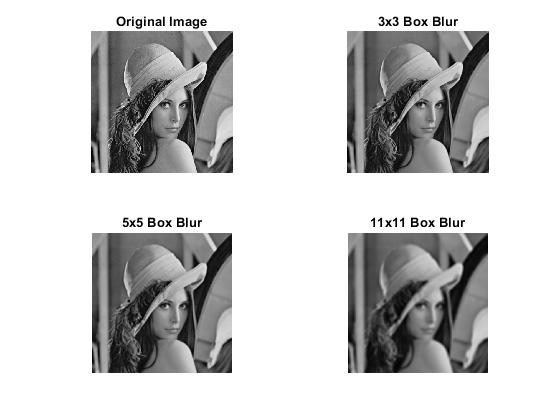
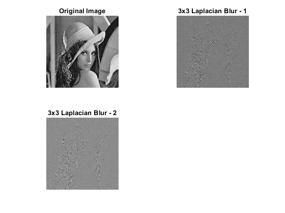

# ECE366: Intro to Signal Processing: Honors Project

This project demonstrates various image convolution(2D-convolution) examples for blurring and edge detection. Also, frequency domain filtering techniques for audio signals are demonstrated. This repo provides a detailed explanation and code.

